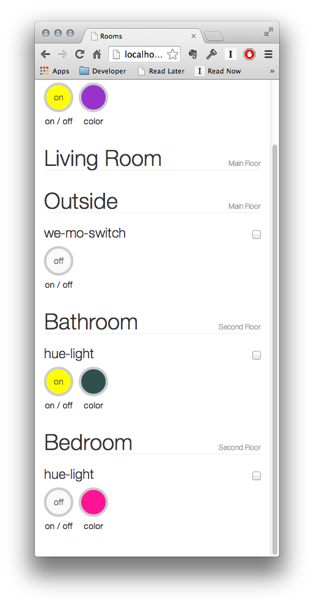

= IOTDB-Home
== Introduction

A web-based interface to your gizmos, using IOTDB and Node.
IOTDB-Home uses introspection to automatically figure out 
the interface to be displayed/

Full documentation is here: 
[https://iotdb.org/docs/home/introduction](https://iotdb.org/docs/home/introduction)

== Screenshots

== Troubleshooting
=== EACCES 

If you get an error something like during <code>npm install</code>

    npm ERR! Error: EACCES, mkdir '/Users/davidjanes/.npm/_git-remotes/git-github-com-dpjanes-iotdb-models-4c9d65ac'
    npm ERR!  { [Error: EACCES, mkdir '/Users/davidjanes/.npm/_git-remotes/git-github-com-dpjanes-iotdb-models-4c9d65ac']
    npm ERR!   errno: 3,
    npm ERR!   code: 'EACCES',
    npm ERR!   path: '/Users/davidjanes/.npm/_git-remotes/git-github-com-dpjanes-iotdb-models-4c9d65ac' }
    npm ERR! 
    npm ERR! Please try running this command again as root/Administrator.

Either use <code>sudo</code> or do

    sudo chmod 777 /Users/davidjanes/.npm/_git-remotes/

